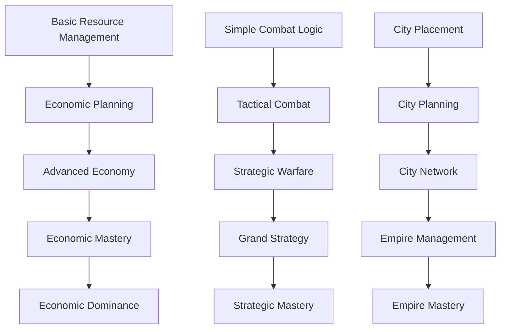
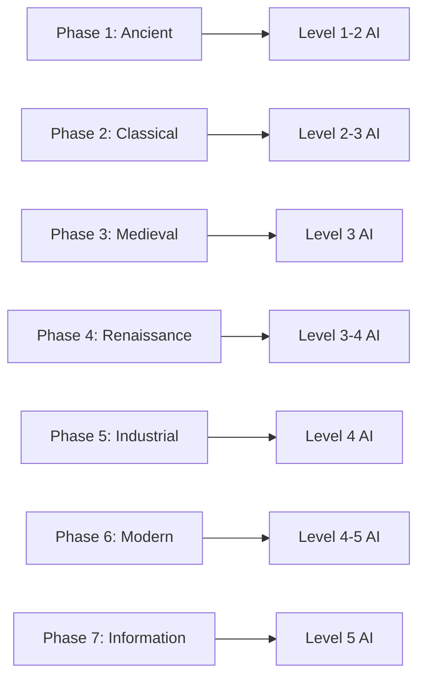

# AI Architecture

## Core Architecture

### Modular AI Design

#### Separate Concerns
- **Divide AI functionalities into distinct modules** (e.g., `EconomyManager`, `MilitaryManager`, `DiplomacyManager`, `TacticalAI`).
- Each module operates independently but can coordinate through well-defined interfaces.

#### Interfaces and Abstract Classes
```kotlin
interface AIModule {
    fun makeDecision(gameState: GameState): Decision
    fun evaluateOutcome(decision: Decision, outcome: Outcome)
}

interface GameStateAnalyzer {
    fun analyzeState(state: GameState): Analysis
}

// Base implementation for all AI levels
abstract class BaseAIImplementation : AIModule {
    protected val economyManager: EconomyManager
    protected val militaryManager: MilitaryManager
    protected val diplomacyManager: DiplomacyManager
    
    abstract fun determineStrategy(gameState: GameState): Strategy
}

// Shared data structures
data class GameState(
    val cities: List<City>,
    val units: List<Unit>,
    val resources: Resources,
    val diplomacy: DiplomaticState
)

data class Decision(
    val action: Action,
    val priority: Float,
    val reasoning: String
)
```

### Decision-Making Core

#### Monte Carlo Tree Search Integration
```kotlin
class MCTSDecisionMaker(
    private val personality: Personality,
    private val victoryFocus: VictoryType
) {
    suspend fun findBestMove(gameState: GameState): Decision = coroutineScope {
        val root = MCTSNode(gameState)
        // Parallel simulation with personality influence
        val simulations = (1..NUM_SIMULATIONS).map { async { 
            root.simulate(personality, victoryFocus)
        }}
        simulations.awaitAll()
        return@coroutineScope root.bestChild().action
    }
}
```

#### Q-Learning Framework
```kotlin
class AdaptiveAI(
    private val personality: Personality,
    private val learningRate: Double = 0.1
) {
    private val qLearning = QLearning(learningRate, DISCOUNT_FACTOR)
    
    fun learn(state: GameState, action: Action, reward: Double) {
        val scaledReward = reward * personality.getTraitInfluence()
        qLearning.update(state, action, scaledReward)
    }
}
```

## AI Implementation Levels

Each level contains three self-contained features that can work independently and be upgraded to the next level.

### Feature Progression Paths



### Level 1: MVP (Minimum Viable Player)
Three independent features that form the foundation:

1. **Basic Resource Management**
   - Simple tile yield optimization
   - Worker automation
   - Resource connection prioritization
   ```kotlin
   class MVPResourceManager : ResourceManager {
       override fun optimizeTileYields(city: City): List<WorkedTile> {
           return city.tiles.sortedByDescending { it.food + it.production + it.gold }
       }
       
       override fun prioritizeWorkerTasks(worker: Worker): WorkerTask {
           return when {
               hasUnconnectedLuxuries() -> ConnectLuxuryResource
               needsFarmImprovement() -> BuildFarm
               else -> BuildMine
           }
       }
   }
   ```

2. **Simple Combat Logic**
   - Basic strength comparison
   - Defensive positioning
   - Ranged unit support
   ```kotlin
   class MVPCombatManager : CombatManager {
       override fun evaluateCombat(attacker: Unit, defender: Unit): CombatDecision {
           val strengthRatio = attacker.strength / defender.strength
           return when {
               strengthRatio > 1.2 -> Attack
               strengthRatio < 0.8 -> Retreat
               else -> HoldPosition
           }
       }
   }
   ```

3. **City Placement**
   - Resource proximity scoring
   - Fresh water evaluation
   - Basic strategic positioning
   ```kotlin
   class MVPCityPlanner : CityPlanner {
       override fun evaluateCityLocation(tile: Tile): Float {
           var score = 0f
           if (tile.isNextToFreshWater()) score += 10
           if (tile.hasLuxuryResource()) score += 8
           score += tile.surroundingTiles.sumOf { it.baseYield }
           return score
       }
   }
   ```

### Level 2: Competent Player
Building upon Level 1 with basic planning capabilities:

1. **Economic Planning**
   - Multi-turn production queuing
   - Trade route optimization
   - Resource stockpiling
   ```kotlin
   class CompetentEconomyManager : EconomyManager {
       override fun planProduction(city: City, turns: Int = 5): List<BuildOrder> {
           val needs = analyzeNeeds(city)
           return optimizeBuildQueue(city.resources, needs, turns)
       }
       
       override fun optimizeTradeRoutes(city: City): List<TradeRoute> {
           return city.possibleTradeRoutes
               .sortedByDescending { it.goldGenerated + it.foodGenerated }
       }
   }
   ```

2. **Tactical Combat**
   - Unit combination effectiveness
   - Terrain advantage calculation
   - Formation management
   ```kotlin
   class CompetentCombatManager : CombatManager {
       override fun planBattle(units: List<Unit>, terrain: Terrain): BattlePlan {
           return BattlePlan(
               formations = optimizeFormations(units, terrain),
               attackVectors = calculateAttackPaths(terrain),
               supportPositions = planRangedSupport(units)
           )
       }
   }
   ```

3. **City Planning**
   - District placement optimization
   - Growth trajectory analysis
   - Specialist allocation
   ```kotlin
   class CompetentCityPlanner : CityPlanner {
       override fun planCityGrowth(city: City): GrowthPlan {
           return GrowthPlan(
               districtPriorities = analyzeDistrictNeeds(city),
               populationTargets = calculateGrowthTargets(city),
               specialistAssignments = optimizeSpecialists(city)
           )
       }
   }
   ```

### Level 3: Advanced Player
Introducing pattern recognition and advanced strategies:

1. **Advanced Economy**
   - Market price prediction
   - Resource trading strategy
   - Economic warfare capabilities
   ```kotlin
   class AdvancedEconomyManager : EconomyManager {
       override fun predictMarketTrends(resources: List<Resource>): MarketPrediction {
           return MarketPrediction(
               priceForecasts = analyzePriceTrends(resources),
               tradingOpportunities = identifyArbitrage(resources),
               competitorAnalysis = analyzeCompetitorTrade()
           )
       }
   }
   ```

2. **Strategic Warfare**
   - Multi-front war management
   - Supply line protection
   - Strategic resource denial
   ```kotlin
   class AdvancedWarfareManager : WarfareManager {
       override fun planCampaign(target: Civilization): WarPlan {
           return WarPlan(
               frontPriorities = analyzeFronts(),
               supplyLines = optimizeSupplyRoutes(),
               resourceTargets = identifyStrategicTargets()
           )
       }
   }
   ```

3. **City Network**
   - Inter-city resource distribution
   - Specialized city roles
   - Network-wide optimization
   ```kotlin
   class AdvancedCityNetwork : CityNetwork {
       override fun optimizeNetwork(cities: List<City>): NetworkPlan {
           return NetworkPlan(
               specializations = assignCityRoles(cities),
               tradeRoutes = optimizeInternalTrade(cities),
               resourceSharing = planResourceDistribution(cities)
           )
       }
   }
   ```

### Level 4: Expert Player
Mastering complex systems and long-term strategy:

1. **Economic Mastery**
   - Global market manipulation
   - Crisis prediction and mitigation
   - Economic dominance strategy
   ```kotlin
   class ExpertEconomyManager : EconomyManager {
       override fun controlMarket(globalMarket: Market): MarketStrategy {
           return MarketStrategy(
               manipulationTargets = identifyMarketOpportunities(),
               crisisResponses = prepareCrisisPlans(),
               dominanceStrategy = planEconomicDominance()
           )
       }
   }
   ```

2. **Grand Strategy**
   - Victory condition pathfinding
   - Diplomatic warfare integration
   - Global power projection
   ```kotlin
   class ExpertStrategyManager : StrategyManager {
       override fun developGrandStrategy(): GrandStrategy {
           return GrandStrategy(
               victoryPath = calculateOptimalVictoryPath(),
               diplomaticMoves = planDiplomaticCampaign(),
               powerProjection = optimizeGlobalInfluence()
           )
       }
   }
   ```

3. **Empire Management**
   - Global resource optimization
   - Empire-wide threat response
   - Civilization specialization
   ```kotlin
   class ExpertEmpireManager : EmpireManager {
       override fun manageEmpire(empire: Empire): ImperialStrategy {
           return ImperialStrategy(
               resourceAllocation = optimizeGlobalResources(),
               threatResponses = prepareContingencies(),
               specialization = planCivilizationFocus()
           )
       }
   }
   ```

### Level 5: Super-Human Expert AI
Achieving perfect optimization and strategic mastery:

1. **Economic Dominance**
   - Perfect market control
   - Multi-civilization economic warfare
   - Resource monopolization
   ```kotlin
   class SuperhumanEconomyManager : EconomyManager {
       override fun achieveEconomicDominance(): DominanceStrategy {
           return DominanceStrategy(
               marketControl = perfectMarketControl(),
               economicWarfare = executeEconomicWarfare(),
               monopolization = controlStrategicResources()
           )
       }
   }
   ```

2. **Strategic Mastery**
   - Multi-victory path optimization
   - Perfect information processing
   - Optimal decision sequencing
   ```kotlin
   class SuperhumanStrategyManager : StrategyManager {
       override fun executeStrategicMastery(): MasterStrategy {
           return MasterStrategy(
               victoryPaths = optimizeAllVictoryPaths(),
               informationProcessing = processPerfectInformation(),
               decisionSequencing = calculateOptimalSequence()
           )
       }
   }
   ```

3. **Empire Mastery**
   - Perfect city synchronization
   - Global optimization algorithms
   - Total civilization control
   ```kotlin
   class SuperhumanEmpireManager : EmpireManager {
       override fun masterEmpire(): GlobalDominance {
           return GlobalDominance(
               citySync = synchronizeAllCities(),
               globalOptimal = achieveOptimalState(),
               totalControl = perfectCivilizationControl()
           )
       }
   }
   ```

## Implementation Principles

1. **Independent Features**
   - Each level's features can function independently
   - Features are testable in isolation
   - Clear interfaces between components

2. **Incremental Development**
   - Features have clear upgrade paths
   - Each level builds on previous capabilities
   - Gradual complexity increase

3. **Phase Alignment**
   - AI levels match historical eras
   - Strategies appropriate to time period
   - Technology-appropriate decisions

4. **Testing Strategy**
   - Individual feature testing
   - Level integration testing
   - Phase completion validation

## External AI Tools Integration

### Level 3: Deep Learning Integration

#### Pattern Recognition with DeepLearning4J
```kotlin
// Required imports
import org.deeplearning4j.nn.multilayer.MultiLayerNetwork
import org.deeplearning4j.nn.conf.NeuralNetConfiguration
import org.nd4j.linalg.api.ndarray.INDArray
import org.nd4j.linalg.factory.Nd4j

class AdvancedPatternRecognition(
    private val network: MultiLayerNetwork = buildNetwork()
) {
    private fun buildNetwork(): MultiLayerNetwork {
        return NeuralNetConfiguration.Builder()
            .seed(123)
            .optimizationAlgo(OptimizationAlgorithm.STOCHASTIC_GRADIENT_DESCENT)
            .iterations(1)
            .learningRate(0.01)
            .regularization(true)
            .l2(0.0001)
            .list()
            .layer(0, DenseLayer.Builder()
                .nIn(numInputs)
                .nOut(100)
                .activation(Activation.RELU)
                .build())
            .layer(1, OutputLayer.Builder()
                .nIn(100)
                .nOut(numOutputs)
                .activation(Activation.SOFTMAX)
                .build())
            .build()
    }

    fun recognizePatterns(gameState: GameState): List<Pattern> {
        val input = convertGameStateToInput(gameState)
        return network.output(input).toPatterns()
    }
}
```

### Level 4: TensorFlow Integration

#### Strategic Analysis Engine
```kotlin
// Required imports
import org.tensorflow.Graph
import org.tensorflow.Session
import org.tensorflow.Tensor
import org.tensorflow.TensorFlow

class StrategicAnalysisEngine(
    private val modelPath: String = "models/strategic_analysis"
) {
    private val graph: Graph = Graph()
    private val session: Session

    init {
        graph.importGraphDef(loadModelFromResources(modelPath))
        session = Session(graph)
    }

    fun evaluateStrategy(gameState: GameState): StrategyEvaluation {
        val stateTensor = gameState.toTensor()
        return session.runner()
            .feed("input", stateTensor)
            .fetch("strategy_output")
            .run()
            .map { tensor -> tensor.toStrategyEvaluation() }
            .first()
    }
}
```

### Level 5: Advanced AI Framework Integration

#### Multi-Model System
```kotlin
// Required imports
import ai.djl.Device
import ai.djl.Model
import ai.djl.inference.Predictor
import ai.djl.ndarray.NDArray
import org.pytorch.PyTorch
import org.pytorch.IValue
import org.pytorch.Module
import com.microsoft.ml.onnx.runtime.*
import org.deeplearning4j.rl4j.learning.sync.qlearning.QLearning

class SuperHumanAISystem {
    // PyTorch integration for pattern prediction
    class PatternPredictor(
        private val model: Module = loadTorchModel("models/pattern_predictor.pt")
    ) {
        fun predictPatterns(gameState: GameState): List<Pattern> {
            val input = gameState.toTensorInput()
            return model.forward(input).toPatterns()
        }
    }

    // ONNX Runtime for strategy optimization
    class StrategyOptimizer(
        private val env: OrtEnvironment = OrtEnvironment.getEnvironment(),
        private val session: OrtSession = createSession()
    ) {
        private fun createSession(): OrtSession {
            return env.createSession(
                "models/strategy_optimizer.onnx",
                OrtSession.SessionOptions()
            )
        }

        fun optimizeStrategy(currentState: GameState): OptimalStrategy {
            val input = OnnxTensor.createTensor(
                env, currentState.toFloatBuffer(), currentState.shape
            )
            return session.run(mapOf("input" to input))
                .toOptimalStrategy()
        }
    }

    // Deep Java Library (DJL) for unified operations
    class UnifiedAIEngine(
        private val model: Model = Model.newInstance("StrategicEngine")
    ) {
        init {
            model.load(modelPath, "strategic_engine")
        }

        fun analyzeGameState(state: GameState): StrategicAnalysis {
            return model.newPredictor().predict(state)
        }
    }
}
```

#### Reinforcement Learning Integration
```kotlin
// Required imports
import org.deeplearning4j.rl4j.learning.sync.qlearning.QLearning
import org.deeplearning4j.rl4j.network.dqn.DQNFactoryStdDense
import org.deeplearning4j.rl4j.policy.DQNPolicy

class ReinforcementLearningSystem {
    private val config = QLearning.QLConfiguration.Builder()
        .seed(123)
        .maxEpochStep(200)
        .expRepMaxSize(150000)
        .batchSize(32)
        .targetDqnUpdateFreq(500)
        .updateStart(10000)
        .rewardFactor(0.01)
        .gamma(0.99)
        .build()

    private val netBuilder = DQNFactoryStdDense.Configuration.Builder()
        .l2(0.001)
        .updater(Adam(learning_rate))
        .numHiddenNodes(256)
        .numLayer(3)
        .build()

    class StrategicDecisionMaker(
        private val mdp: CivilizationMDP,
        private val policy: DQNPolicy<GameState>
    ) {
        fun makeDecision(state: GameState): Action {
            return policy.nextAction(state)
        }

        fun learn(experience: Experience) {
            policy.train(experience)
        }
    }
}
```

#### GPU Acceleration Support
```kotlin
class GPUAccelerator {
    private val cuda = CudaEnvironment.getInstance()
    
    init {
        cuda.configuration
            .allowMultiGPU(true)
            .useDevices(*getAvailableDevices())
    }

    fun evaluateStrategiesInParallel(
        strategies: List<Strategy>
    ): List<StrategyEvaluation> {
        return strategies.chunked(batchSize).flatMap { batch ->
            cuda.executeAsync { evaluateBatch(batch) }
        }
    }
}
```

#### Hybrid AI System
```kotlin
class HybridAISystem(
    private val tensorflow: StrategicAnalysisEngine,
    private val pytorch: PatternPredictor,
    private val onnx: StrategyOptimizer,
    private val rl: StrategicDecisionMaker
) {
    fun makeStrategicDecision(gameState: GameState): Decision {
        return HybridDecisionMaker.combine(
            tensorflow.evaluateStrategy(gameState),
            pytorch.predictPatterns(gameState),
            onnx.optimizeStrategy(gameState),
            rl.makeDecision(gameState),
            weights = calculateDynamicWeights(gameState)
        )
    }
}
```

#### Model Management
```kotlin
interface ModelManager {
    fun loadModel(version: String): Model
    fun saveModel(model: Model, version: String)
    fun validateModel(model: Model): Boolean
    
    fun compareModels(
        modelA: Model,
        modelB: Model,
        testCases: List<GameState>
    ): ComparisonResult
}
```

## AI Strategies by Phase

### Phase Alignment with AI Levels



### Ancient Era (Phase 1) Strategies
Using Level 1-2 AI capabilities:
- Basic expansion and settler placement
- Early military defense and exploration
- Resource-focused city development

### Classical Era (Phase 2) Strategies
Using Level 2-3 AI capabilities:
- Cultural development and border expansion
- Military foundation and unit composition
- Basic diplomatic relations

### Medieval Era (Phase 3) Strategies
Using Level 3 AI capabilities:
- Religious expansion and pressure
- Advanced military tactics
- Complex diplomatic relations

### Renaissance Era (Phase 4) Strategies
Using Level 3-4 AI capabilities:
- Scientific research optimization
- Economic development and trade
- Cultural influence projection

### Industrial Era (Phase 5) Strategies
Using Level 4 AI capabilities:
- Production optimization
- Strategic resource control
- Global diplomatic manipulation

### Modern Era (Phase 6) Strategies
Using Level 4-5 AI capabilities:
- Victory condition execution
- Global power projection
- Advanced warfare tactics

### Information Era (Phase 7) Strategies
Using Level 5 AI capabilities:
- Perfect technological progression
- Ultimate victory optimization
- Complete strategic dominance

## Integration Components

### Personality System
```kotlin
class PersonalityManager(private val personality: Personality) {
    fun influenceDecision(decision: Decision): Decision {
        return decision.copy(
            priority = decision.priority * personality.getFocusMultiplier(decision.type),
            reasoning = "${decision.reasoning} (Influenced by ${personality.primaryTrait})"
        )
    }
}
```

### Victory Type Integration
```kotlin
class VictoryStrategyManager(
    private val civ: Civilization,
    private val personality: Personality
) : AIModule {
    override fun makeDecision(gameState: GameState): Decision {
        val victoryFocus = when (civ.preferredVictoryType) {
            VictoryType.SCIENCE -> calculatePriority(gameState.scienceOutput, PersonalityValue.Science)
            VictoryType.CULTURE -> calculatePriority(gameState.cultureOutput, PersonalityValue.Culture)
            VictoryType.DOMINATION -> calculatePriority(gameState.militaryStrength, PersonalityValue.Military)
            else -> 0.5f
        }
        return Decision(
            action = determineAction(victoryFocus),
            priority = victoryFocus,
            reasoning = "Aligned with ${civ.preferredVictoryType} victory strategy"
        )
    }
}
```

## Supporting Systems

### Data Collection
```kotlin
interface DataCollector {
    // Start collecting at MVP level
    fun recordDecision(state: GameState, decision: Decision)
    fun recordOutcome(decision: Decision, outcome: Outcome)
    
    // Add for Level 3+
    fun exportTrainingData(): Dataset
    fun analyzePerformance(): PerformanceMetrics
}
```

### Model Training Pipeline
```kotlin
interface ModelTrainer {
    // Start simple with Level 3
    fun trainBasicModel(data: Dataset): MultiLayerNetwork
    
    // Add for Level 4
    fun trainTensorFlowModel(data: Dataset): Graph
    
    // Add for Level 5
    fun trainHybridSystem(data: Dataset): HybridModel
}
```

### Testing Framework
```kotlin
interface AITester {
    // Basic tests for all levels
    fun testBasicFunctionality(ai: AIDecisionMaker)
    
    // Add for Level 3+
    fun benchmarkPerformance(ai: AIDecisionMaker)
    
    // Add for Level 5
    fun compareWithHuman(ai: AIDecisionMaker)
}
```

### Performance Monitoring
```kotlin
interface PerformanceMonitor {
    // Start monitoring at MVP
    fun trackBasicMetrics(decision: Decision, outcome: Outcome)
    
    // Add for Level 3+
    fun trackMLMetrics(predictions: Predictions, actual: Outcomes)
    
    // Add for Level 5
    fun trackHybridSystemMetrics(
        components: List<AIComponent>,
        finalDecision: Decision
    )
}
```

## Integration Guidelines

1. **Modular Implementation**
   - Each technique should be implemented as a separate module
   - Clear interfaces between different AI systems
   - Configurable through personality traits

2. **Performance Considerations**
   - Lazy evaluation for expensive computations
   - Caching of frequently accessed data
   - Parallel processing where applicable

3. **Extensibility**
   - Plugin architecture for new AI techniques
   - Version control for different strategy sets
   - A/B testing framework for strategy evaluation