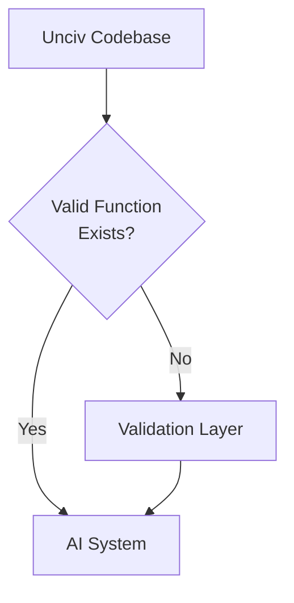

## 1. Key Places to Look:

1. **UI Component Entry Points:**
   - `WorldScreen.kt` - Main game interface
   - `UnitTable.kt` - Unit information display
   - `CityScreen.kt` - City management interface
   - `BattleTable.kt` - Combat information

2. **Core Game Logic Classes:**
   - `MapUnit.kt` - Unit state and actions
   - `City.kt` - City state and management
   - `Battle.kt` - Combat mechanics
   - `Civilization.kt` - Civilization state and actions

### 1.1 Verified Raw Inputs:

1. **Unit State Queries:**
`````kotlin:MapUnit.kt
// Movement
unit.hasMovement(): Boolean
unit.canMoveTo(tile: Tile): Boolean
unit.getMaxMovement(): Int

// Combat
unit.canAttack(): Boolean
unit.canAttackTarget(target: MapUnit): Boolean
unit.isFortified(): Boolean
unit.isEmbarked(): Boolean

// Unit State
unit.isCivilian(): Boolean
unit.canGarrison(): Boolean
unit.canPillage(): Boolean
`````

2. **City State Queries:**
`````kotlin:City.kt
// Resources and Production
city.canBuildUnit(unit: String): Boolean
city.canBuild(construction: String): Boolean
city.isConnectedToCapital(): Boolean
city.isBlockaded(): Boolean

// Combat
city.getCombatStrength(): Int
city.getRangedCombatStrength(): Int
city.canBombard(): Boolean
`````

3. **Civilization State Queries:**
`````kotlin:Civilization.kt
// Resources
civInfo.getGold(): Int
civInfo.getHappiness(): Float
civInfo.getScience(): Float

// Diplomacy
civInfo.isAtWarWith(otherCiv: Civilization): Boolean
civInfo.getDiplomacyStatus(otherCiv: Civilization): DiplomaticStatus
`````

### Verified Raw Outputs:

1. **Unit Commands:**
`````kotlin:MapUnit.kt
// Movement
unit.movement.moveToTile(tile: Tile)
unit.fortify()
unit.sleep()
unit.garrison()

// Combat
unit.doAttack(defender: MapUnit)
unit.pillage()
unit.fortifyUntilHealed()
`````

2. **City Commands:**
`````kotlin:City.kt
// Production
city.startBuilding(construction: String)
city.purchaseBuilding(building: String)
city.buyTile(tile: Tile)

// Management
city.assignPopulation(tile: Tile)
city.setFocus(focus: String)
`````

3. **Civilization Commands:**
`````kotlin:Civilization.kt
// Diplomacy
civInfo.declareWar(otherCiv: Civilization)
civInfo.makePeace(otherCiv: Civilization)
civInfo.proposeTrade(trade: Trade)

// Research
civInfo.tech.startResearchOf(tech: String)
`````

### 1.2 Strategy to Find More:

1. **Follow UI Flow:**
   - Trace each button/action in the UI to its underlying function
   - Verify the function includes proper validation
   - Check if it's a direct input/output or a composite action

2. **Check Core Game Classes:**
   - Look for public methods with validation
   - Verify they represent atomic actions
   - Ensure they match human player capabilities

Would you like me to:
1. Continue listing more verified inputs/outputs?
2. Focus on a specific category?
3. Analyze a particular game system in detail?


## 2. Current Files Accessing for AI and Human Players:
 Valid Raw Inputs and Outputs

Based on the definitions in `valid_raw_input_output.md`, below is a comprehensive mapping of the current UnCiv codebase files where both AI and Human players access valid raw inputs and outputs.

### 2.1 Human Player Access

Human interactions are primarily handled through UI components. These files interact with the core game logic to retrieve information and execute actions based on user inputs.

#### 2.1.1 `WorldScreen.kt` - Main Game Interface
- **Accessed Inputs:**
  - `unit.hasMovement()`
  - `unit.canAttack()`
  - `tile.isVisible(civInfo)`
- **Accessed Outputs:**
  - `unit.movement.moveToTile(tile)`
  - `unit.doAttack(defender)`

```kotlin
// Example of accessing inputs
if (unit.canAttack()) {
    // Enable attack button in UI
}

// Example of executing output
fun onAttackButtonClick() {
    unit.doAttack(selectedDefender)
}
```

#### 2.1.2 `UnitTable.kt` - Unit Information Display
- **Accessed Inputs:**
  - `unit.getMaxMovement()`
  - `unit.isFortified()`
- **Accessed Outputs:**
  - `unit.fortify()`
  - `unit.sleep()`

```kotlin
// Display unit stats
val movementPoints = unit.getMaxMovement()
val isFortified = unit.isFortified()

// User action to fortify unit
fun onFortifyButtonClick() {
    unit.fortify()
}

// User action to put unit to sleep
fun onSleepButtonClick() {
    unit.sleep()
}
```

#### 2.1.3 `CityScreen.kt` - City Management Interface
- **Accessed Inputs:**
  - `city.canBuildUnit(unitName)`
  - `city.getCombatStrength()`
- **Accessed Outputs:**
  - `city.startBuilding(construction)`
  - `city.purchaseBuilding(building)`

```kotlin
// Display city options
if (city.canBuildUnit("Settler")) {
    // Show build settler button
}

if (city.canBuild("Library")) {
    // Show build library button
}

// User action to start building a unit
fun onBuildSettlerClick() {
    city.startBuilding("Settler")
}

// User action to purchase a building
fun onPurchaseBuildingClick() {
    city.purchaseBuilding("Library")
}
```

#### 2.1.4 `BattleTable.kt` - Combat Information
- **Accessed Inputs:**
  - `unit.canAttackTarget(targetUnit)`
  - `unit.isEmbarked()`
- **Accessed Outputs:**
  - `unit.doAttack(defender)`
  - `unit.pillage()`

```kotlin
// Display combat options
if (unit.canAttackTarget(targetUnit)) {
    // Enable attack option in UI
}

if (!unit.isEmbarked()) {
    // Enable pillage option in UI
}

// User action to attack
fun onAttackButtonClick() {
    unit.doAttack(targetUnit)
}

// User action to pillage
fun onPillageButtonClick() {
    unit.pillage()
}
```

### 2.2 AI Player Access

The AI interacts with the game through dedicated modules within the AI processing pipeline. These modules utilize the same core game logic to retrieve information and execute actions autonomously.

#### 2.2.1 `AAutoExpert.kt` - Main Coordinator
- **Accessed Inputs:**
  - `unit.getMaxMovement()`
  - `civInfo.getGold()`
- **Accessed Outputs:**
  - `unit.movement.moveToTile(tile)`
  - `civInfo.declareWar(otherCiv)`

```kotlin
// AI decision-making based on gold
val gold = civInfo.getGold()
if (gold > 1000) {
    civInfo.declareWar(targetCiv)
}

// AI movement decision
val targetTile = determineOptimalMove(tile)
unit.movement.moveToTile(targetTile)
```

#### 2.2.2 `ExpertRawInput.kt` - Game State Collection
- **Accessed Inputs:**
  - `unit.hasMovement()`
  - `city.isBlockaded()`

```kotlin
// Collecting inputs for AI processing
val canMove = unit.hasMovement()
val isBlockaded = city.isBlockaded()
```

    #### 2.2.3 `ExpertRawOutput.kt` - Action Execution
- **Accessed Outputs:**
  - `unit.doAttack(defender)`
  - `city.assignPopulation(tile)`

```kotlin
// Executing AI combat action
unit.doAttack(targetUnit)

// Executing AI city management action
city.assignPopulation(newTile)
```

#### 2.2.4 `ExpertMilitaryModule.kt` - Military Coordination
- **Accessed Inputs:**
  - `unit.canAttack()`
  - `unit.isCivilian()`
- **Accessed Outputs:**
  - `unit.fortify()`
  - `unit.garrison()`

```kotlin
// AI military decision-making
if (unit.canAttack() && !unit.isCivilian()) {
    unit.doAttack(enemyUnit)
} else {
    unit.fortify()
}

// AI decision to garrison a unit
if (shouldGarrison(unit)) {
    unit.garrison()
}
```

### 2.3 Core Game Logic Classes

Both AI and Human players interact with core game logic classes to retrieve game state and perform actions. These classes contain the underlying implementations of game mechanics.

#### 2.3.1 `MapUnit.kt` - Unit State and Actions
- **Accessed Inputs:**
  - `unit.hasMovement()`
  - `unit.canAttack()`
  - `unit.isEmbarked()`
- **Accessed Outputs:**
  - `unit.movement.moveToTile(tile)`
  - `unit.doAttack(defender)`

```kotlin
// Example usage by both AI and Human
if (unit.canAttack()) {
    unit.doAttack(targetUnit)
}

unit.movement.moveToTile(newTile)
```

#### 2.3.2 `City.kt` - City State and Management
- **Accessed Inputs:**
  - `city.canBuildUnit(unitName)`
  - `city.isConnectedToCapital()`
- **Accessed Outputs:**
  - `city.startBuilding(construction)`
  - `city.purchaseBuilding(building)`

```kotlin
// Example usage by both AI and Human
if (city.canBuildUnit("Settler")) {
    city.startBuilding("Settler")
}

if (city.canBuild("Library")) {
    city.purchaseBuilding("Library")
}
```

#### 2.3.3 `Civilization.kt` - Civilization State and Actions
- **Accessed Inputs:**
  - `civInfo.getGold()`
  - `civInfo.isAtWarWith(otherCiv)`
- **Accessed Outputs:**
  - `civInfo.declareWar(otherCiv)`
  - `civInfo.makePeace(otherCiv)`

```kotlin
// Example usage by both AI and Human
if (civInfo.getGold() > 1000) {
    civInfo.declareWar(otherCiv)
}

civInfo.makePeace(otherCiv)
```

#### 2.3.4 `Battle.kt` - Combat Mechanics
- **Accessed Inputs:**
  - `unit.canAttack()`
  - `defender.isFortified()`
- **Accessed Outputs:**
  - `executeBattle(attacker, defender)`

```kotlin
// Combat execution by both AI and Human
if (attacker.canAttack() && defender.isFortified()) {
    executeBattle(attacker, defender)
}
```

### 2.4 Summary

The access points for both AI and Human players to valid raw inputs and outputs are distributed across UI components, AI pipeline modules, and core game logic classes. The AI interacts through specialized modules within `expertpipeline` and `expertmodules`, while Human interactions are managed via UI components like `WorldScreen.kt`, `UnitTable.kt`, `CityScreen.kt`, and `BattleTable.kt`. Both AI and Human methods rely on core game logic classes such as `MapUnit.kt`, `City.kt`, and `Civilization.kt` to ensure consistent enforcement of game rules and mechanics.


## 3. Refined Definitions and Implementation:

### 3.1 Raw Input Definition
> A direct query of game state that:
1. Returns unmodified data directly from the game's data structures
2. Does not perform calculations or transformations beyond mandatory validation
3. Does not trigger state changes
4. Is accessible through public interfaces
5. Only accesses information that would be visible to a human player
6. Includes necessary validation logic to prevent illegal state access

### 3.2 Raw Output Definition
> A direct action that:
1. Maps 1:1 with a single player action
2. Has direct, observable effects
3. Cannot be broken down into more fundamental actions
4. Includes mandatory validation checks
5. Only performs actions available to human players
6. Uses established game mechanics for state changes

### 3.3 Implementation Strategy

When implementing the AI system, we follow this process for handling inputs/outputs:

1. **Check Unciv Codebase First:**
```kotlin
// First try to use existing valid function
if (unit.hasMovement()) {  // Valid function exists in codebase
    // Use directly
}
```

2. **Use Validator If Needed:**
```kotlin
// If valid function doesn't exist, use validator
if (ValidRawInputValidator.UnitValidation.canFoundCity(unit, tile)) {
    // Process using validated input
}
```

3. **Document Usage:**
```kotlin
// Document which path is being used
class ExpertSettlerHandler {
    fun handleSettler(unit: MapUnit) {
        // Using existing valid input
        if (unit.hasMovement()) {
            // Using validator for missing valid input
            if (ValidRawInputValidator.UnitValidation.canFoundCity(unit, tile)) {
                // Using validator for missing valid output
                ValidRawOutputValidator.UnitCommands.foundCity(unit)
            }
        }
    }
}
```

### 3.4 Validation Layer Integration

The validation layer serves as a bridge when valid raw inputs/outputs don't exist in the codebase:



1. **Input Validation:**
   - First check for valid input in codebase
   - Use ValidRawInputValidator if needed
   - Ensure all validation rules are followed

2. **Output Validation:**
   - First check for valid output in codebase
   - Use ValidRawOutputValidator if needed
   - Maintain proper game mechanics
