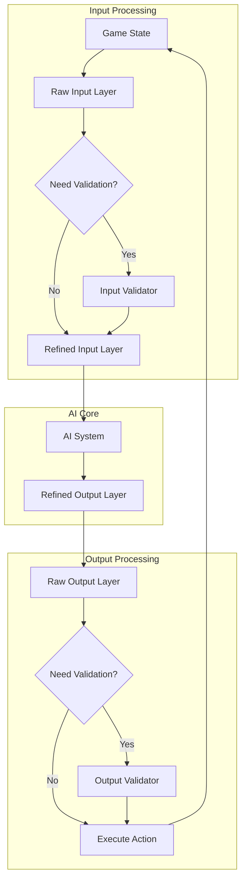

# Core Validation Concepts

This document defines the fundamental concepts and patterns for input/output validation in the AAutoExpert AI system.

## 1. Validation Fundamentals

### 1.1 Valid Raw Input
A direct query of game state that:
1. Returns unmodified data directly from game data structures
2. Does not perform calculations beyond mandatory validation
3. Does not trigger state changes
4. Is accessible through public interfaces
5. Only accesses information visible to human players
6. Includes necessary validation logic

### 1.2 Valid Raw Output
A direct action that:
1. Maps 1:1 with a single player action
2. Has direct, observable effects
3. Cannot be broken down into more fundamental actions
4. Includes mandatory validation checks
5. Only performs actions available to human players
6. Uses established game mechanics

## 2. The 5-Layer Pipeline System

### 2.1 Overview
Our AI pipeline consists of 5 layers that ensure safe and correct operation:

1. **Raw Input Layer**
   - First checks for valid input functions in Unciv codebase
   - Routes through ValidRawInputValidator if needed
   - Validates against fog-of-war and visibility rules
   - Blocks access to hidden information

2. **Input Refinement Layer**
   - Transforms raw data into AI-optimized formats
   - Calculates derived metrics (threat levels, resource efficiency)
   - Caches and indexes frequently accessed information
   - Structures data for efficient AI processing

3. **Strategic Decision Core**
   - Processes refined inputs through advanced algorithms
   - Evaluates options based on personality traits and victory goals
   - Generates weighted decision trees for possible actions
   - Balances short-term tactics with long-term strategy

4. **Output Refinement Layer**
   - Converts AI decisions to structured action plans
   - Validates action sequences for feasibility
   - Optimizes execution order and timing
   - Packages commands for game system consumption

5. **Raw Output Layer**
   - First checks for valid output functions in Unciv codebase
   - Routes through ValidRawOutputValidator if needed
   - Verifies all actions comply with game rules
   - Executes validated actions through proper channels

### 2.2 Practical Application
When implementing AI features:
```kotlin
// Raw Input Layer: Check existing functions first
val unit = tile.militaryUnit  // Direct codebase access
if (unit == null) {
    // Use validator if needed
    val canFoundCity = ValidRawInputValidator.UnitValidation.canFoundCity(settler, tile)
}

// Input Refinement Layer: Transform for AI use
val cityValue = CityPlacementCalculator.evaluateLocation(tile)

// Strategic Decision Core: Make decision
val decision = SettlerStrategy.decideBestLocation(cityValue, otherFactors)

// Output Refinement Layer: Plan execution
val moveSequence = PathFinder.calculateOptimalPath(settler, decision.targetTile)

// Raw Output Layer: Execute through proper channels
if (ValidRawOutputValidator.UnitCommands.exists("foundCity")) {
    settler.foundCity()  // Direct codebase call
} else {
    ValidRawOutputValidator.UnitCommands.foundCity(settler)  // Use validator
}
```

## 3. Validation Patterns

### 3.1 Input Validation Pattern
```kotlin
// Template for input validation
fun validateInput(params: InputParams): Boolean {
    // 1. Early validation
    if (!validateBasicRequirements(params)) return false
    
    // 2. Game rule validation
    if (!validateGameRules(params)) return false
    
    // 3. State validation
    if (!validateGameState(params)) return false
    
    return true
}
```

### 3.2 Output Validation Pattern
```kotlin
// Template for output validation
fun validateAndExecuteOutput(params: OutputParams): Boolean {
    // 1. Pre-execution validation
    if (!validatePreConditions(params)) return false
    
    // 2. Execute action through game mechanics
    val result = executeGameAction(params)
    
    // 3. Post-execution validation
    if (!validatePostConditions(params, result)) {
        rollbackIfNecessary(params)
        return false
    }
    
    return true
}
```

## 4. Common Validation Rules

### 4.1 Visibility Rules
- Only access tiles visible to the civilization
- Only query units and cities in visible tiles
- Respect fog of war mechanics

### 4.2 Resource Rules
- Only access known resources
- Validate resource requirements for actions
- Check resource availability before use

### 4.3 Movement Rules
- Validate movement points
- Check terrain accessibility
- Verify path validity

### 4.4 Combat Rules
- Validate combat eligibility
- Check range and line of sight
- Verify combat mechanics

## 5. Validation Layer Architecture

### 5.1 Five-Layer System Overview


### 5.2 Layer Responsibilities

1. **Raw Input Layer**
   - Direct game state queries
   - Uses validators when needed
   - No data transformation
   ```kotlin
   // Example raw input with validation
   fun getRawUnitState(unit: MapUnit): UnitState {
       return if (ValidRawInputValidator.exists(unit)) {
           unit.getState()  // Direct use
       } else {
           ValidRawInputValidator.getUnitState(unit)  // Use validator
       }
   }
   ```

2. **Refined Input Layer**
   - Transforms raw inputs into AI-usable format
   - Combines multiple raw inputs if needed
   - Maintains validation integrity
   ```kotlin
   // Example refined input
   fun getUnitCapabilities(unit: MapUnit): UnitCapabilities {
       val rawMovement = getRawUnitState(unit).movement
       val rawCombat = getRawUnitState(unit).combat
       return UnitCapabilities(
           canMove = rawMovement > 0,
           canAttack = rawCombat.canAttack,
           // ... other refined properties
       )
   }
   ```

3. **AI Core**
   - Uses refined inputs for decision making
   - Produces refined outputs
   - No direct game state access

4. **Refined Output Layer**
   - Transforms AI decisions into game actions
   - Prepares validation requirements
   - Routes to raw output layer

5. **Raw Output Layer**
   - Executes game actions
   - Uses validators when needed
   - Maintains game state integrity
   ```kotlin
   // Example raw output with validation
   fun executeUnitMove(unit: MapUnit, tile: Tile): Boolean {
       return if (ValidRawOutputValidator.exists("moveUnit")) {
           unit.moveToTile(tile)  // Direct use
       } else {
           ValidRawOutputValidator.UnitCommands.moveUnit(unit, tile)  // Use validator
       }
   }
   ```

### 5.3 Validation Flow

1. **Input Validation**
   - Raw input layer checks for validator need
   - Validator ensures game rule compliance
   - Results passed to refined input layer

2. **Output Validation**
   - Raw output layer checks for validator need
   - Validator ensures action validity
   - Executes action if valid
   - Maintains state consistency

## 6. Performance Considerations

### 6.1 Validation Costs
- Cache validation results when possible
- Avoid redundant validations
- Use early returns for invalid states

### 6.2 Optimization Patterns
```kotlin
// Example of optimized validation
class CachedValidator {
    private val cache = mutableMapOf<InputParams, Boolean>()
    
    fun validate(params: InputParams): Boolean {
        return cache.getOrPut(params) {
            performExpensiveValidation(params)
        }
    }
}
```

## 7. Testing Requirements

### 7.1 Validation Tests
- Test both valid and invalid cases
- Verify proper error handling
- Check edge cases
- Validate performance

### 7.2 Integration Tests
- Test validation in game context
- Verify state consistency
- Check interaction with other systems

## 8. Documentation Requirements

### 8.1 Validator Documentation
```kotlin
/**
 * Validates unit movement to target tile
 * @param unit The unit to move
 * @param tile The target tile
 * @return true if movement is valid
 * 
 * Requirements:
 * 1. Unit must have movement points
 * 2. Tile must be accessible
 * 3. Path must be valid
 * 
 * Performance: O(1) for basic validation
 * Cache: Movement points are cached
 */
fun validateMovement(unit: Unit, tile: Tile): Boolean
```

### 8.2 Example Documentation
- Provide clear examples
- Document edge cases
- Note performance implications
- Specify cache behavior 