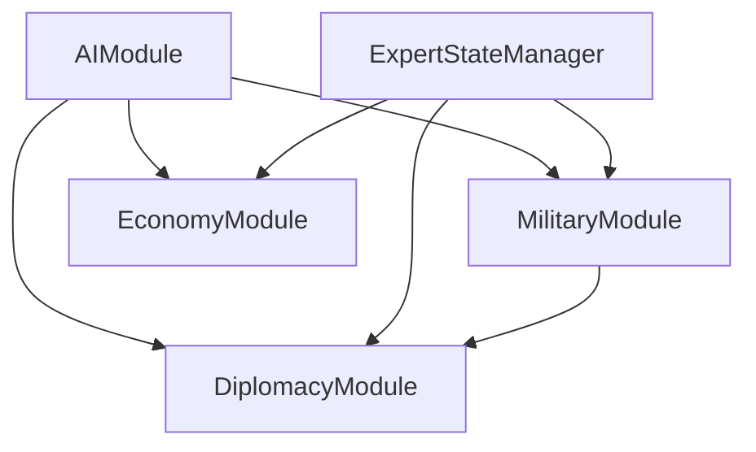

# AAutoExpert Technical Architecture

> This document details the technical implementation of the AAutoExpert AI system. It serves as the authoritative source for architectural decisions and system design.

> **Architecture Documentation Requirements**
>
> This document should be updated when:
>
> 1. **New Modules Added/Changed**: When new folders or `.kt` files are added or changed in `aautoexpert/`, document:
>    - Module's purpose and responsibilities
>    - Key interfaces and classes
>    - Integration points with existing modules
>
> 2. **Major Structural Changes**: When relevant section in `.kt` files or folders in `aautoexpert/` file structure do not match this document:
>    - Update relevant architecture diagrams
>    - Document new data flows
>    - Note any deprecated patterns
>
> 3. **Integration Changes**: When modifying how AAutoExpert interfaces with the base game:
>    - Document new integration points
>    - Update external module dependencies
>    - Note any breaking changes
>
> This document MUST reflect the current folders and .kt files in the file structure of `aautoexpert/` and NOT future plans. Future plans belong in `road_map.md`.

## Current Project Structure
```
aautoexpert/
├── AAutoExpert.kt                # Main entry point
├── modules/
│   ├── military/                 # Military decision making
│   │   └── MilitaryModule.kt
│   └── core/                     # Shared utilities
│       └── AIModule.kt           # Base interface
```

## Table of Contents

1. [Core Architecture](#1-core-architecture)
   1.1 [Integration with Unciv](#11-integration-with-unciv)
   1.2 [Decision Making Pipeline](#12-decision-making-pipeline)
   1.3 [Module System](#13-module-system)
2. [Current Implementation](#2-current-implementation)
   2.1 [Military Module](#21-military-module)
   2.2 [Core Systems](#22-core-systems)
   2.3 [Testing Framework](#23-testing-framework)
3. [Extension Points](#3-extension-points)
   3.1 [Adding New Modules](#31-adding-new-modules)
   3.2 [Extending Existing Modules](#32-extending-existing-modules)
   3.3 [Testing Requirements](#33-testing-requirements)
4. [Module Dependencies](#4-module-dependencies)
   4.1 [Core Dependencies](#41-core-dependencies)
   4.2 [Integration Dependencies](#42-integration-dependencies)
5. [Performance and Optimization](#5-performance-and-optimization)
   5.1 [Optimization Strategies](#51-optimization-strategies)
   5.2 [Resource Management](#52-resource-management)
   5.3 [Performance Monitoring](#53-performance-monitoring)
6. [Development Workflow](#6-development-workflow)
   6.1 [Module Development](#61-module-development)
   6.2 [Integration Process](#62-integration-process)
   6.3 [Version Control Practices](#63-version-control-practices)

---

## 1. Core Architecture

### 1.1 Integration with Unciv

- **Turn System Hook**
  - **Path:** `core/src/com/unciv/logic/aautoexpert/AAutoExpert.kt`
  ```kotlin:path/to/Unciv---Zeph-Testing/core/src/com/unciv/logic/aautoexpert/AAutoExpert.kt
  fun startTurn(worldScreen: WorldScreen) {
      val civInfo = worldScreen.viewingCiv
      // Trigger AI turn processing
      executeTurn(civInfo)
  }
  ```
  - **Description:** AAutoExpert hooks into Unciv's turn system by overriding the `startTurn` method. It accesses the current civilization's state and initiates the AI's turn processing through `executeTurn`.

- **Game State Access**
  - **Path:** `core/src/com/unciv/logic/aautoexpert/modules/military/MilitaryModule.kt`
  ```kotlin:Unciv---Zeph-Testing/core/src/com/unciv/logic/aautoexpert/modules/military/MilitaryModule.kt
  class MilitaryModule : AIModule {
      override fun execute(civInfo: Civilization) {
          val units = civInfo.units.getCivUnits()
          units.forEach { handleUnit(it) }
      }
      
      private fun handleUnit(unit: Unit) {
          // Unit handling logic
      }
  }
  ```
  - **Description:** Modules access the game state through the `Civilization` object passed to their `execute` method. This allows modules like `MilitaryModule` to retrieve and manipulate units, cities, and other game elements.

### 1.2 Decision Making Pipeline

- **Pipeline Overview**
  - **Path:** `core/src/com/unciv/logic/aautoexpert/AAutoExpert.kt`
  ```kotlin:Unciv---Zeph-Testing/core/src/com/unciv/logic/aautoexpert/AAutoExpert.kt
  fun executeTurn(civInfo: Civilization) {
      modules.forEach { it.execute(civInfo) }
      updateGameState(civInfo)
  }
  ```
  - **Description:** The `executeTurn` method iterates through all active modules, allowing each to perform their specific AI actions. After all modules have executed, the game state is updated to reflect the changes made by the AI.

- **Priority Handling**
  - **Path:** `core/src/com/unciv/logic/aautoexpert/modules/military/MilitaryModule.kt`
  ```kotlin:Unciv---Zeph-Testing/core/src/com/unciv/logic/aautoexpert/modules/military/MilitaryModule.kt
  fun execute(civInfo: Civilization) {
      val prioritizedUnits = prioritizeUnits(civInfo.units.getCivUnits())
      prioritizedUnits.forEach { unit ->
          handleUnit(unit)
      }
  }
  
  private fun prioritizeUnits(units: List<Unit>): List<Unit> {
      return units.sortedByDescending { it.priority }
  }
  ```
  - **Description:** Units are prioritized based on predefined criteria (e.g., unit type, threat level). Higher priority units are handled first to ensure critical actions are addressed promptly.

### 1.3 Module System

- **Core Module Interfaces**
  - **Path:** `core/src/com/unciv/logic/aautoexpert/modules/core/AIModule.kt`
  ```kotlin:Unciv---Zeph-Testing/core/src/com/unciv/logic/aautoexpert/modules/core/AIModule.kt
  interface AIModule {
      fun execute(civInfo: Civilization)
  }
  ```
  - **Description:** `AIModule` defines the contract for all AI modules. Each module implements the `execute` method, which receives the current `Civilization` state and performs its logic.

- **Inter-Module Communication**
  - Modules communicate through shared services or event-driven patterns.
  - **Example:** `MilitaryModule` interacts with `BattleHelper` to execute combat actions.
  - **Path:** `core/src/com/unciv/logic/aautoexpert/modules/military/MilitaryModule.kt`
  ```kotlin:Unciv---Zeph-Testing/core/src/com/unciv/logic/aautoexpert/modules/military/MilitaryModule.kt
  class MilitaryModule : AIModule {
      private val battleHelper = BattleHelper()
      
      override fun execute(civInfo: Civilization) {
          civInfo.units.getCivUnits().forEach { unit ->
              if (unit.isMilitary) {
                  battleHelper.tryAttackNearbyEnemy(unit)
              }
          }
      }
  }
  ```

---

## 2. Current Implementation

### 2.1 Military Module

- **Path:** `core/src/com/unciv/logic/aautoexpert/modules/military/MilitaryModule.kt`
- **Responsibilities:**
  - Decision-making for military units, including ranged, melee, naval, and air units.
- **Key Functionalities:**
  - Unit handling based on type and priority.
  - Interaction with `BattleHelper` for combat actions.

```kotlin:Unciv---Zeph-Testing/core/src/com/unciv/logic/aautoexpert/modules/military/MilitaryModule.kt
class MilitaryModule : AIModule {
    private val battleHelper = BattleHelper()
    
    override fun execute(civInfo: Civilization) {
        val prioritizedUnits = prioritizeUnits(civInfo.units.getCivUnits())
        prioritizedUnits.forEach { unit ->
            handleUnit(unit)
        }
    }
    
    private fun prioritizeUnits(units: List<Unit>): List<Unit> {
        return units.sortedByDescending { it.priority }
    }
    
    private fun handleUnit(unit: Unit) {
        if (unit.isMilitary) {
            battleHelper.tryAttackNearbyEnemy(unit)
        }
    }
}
```

### 2.2 Core Systems

- **Path:** `core/src/com/unciv/logic/aautoexpert/modules/core/AIModule.kt`
- **Components:**
  - **AAutoExpert.kt**: Main entry point.
  - **AIModule.kt**: Base interface.
  - **BattleHelper.kt**: Utility for combat operations.

```kotlin:Unciv---Zeph-Testing/core/src/com/unciv/logic/aautoexpert/modules/core/AIModule.kt
interface AIModule {
    fun execute(civInfo: Civilization)
}
```

### 2.3 Testing Framework

- **Unit Testing:**
  - Utilize **JUnit** and **Mockito** to write unit tests for modules.
  - Example: Testing the `execute` method in `MilitaryModule`.
- **Integration Testing:**
  - Validate interactions between `MilitaryModule` and `BattleHelper`.
- **Test Data:**
  - Utilize mock `Civilization` and `Unit` objects to simulate game states.

---

## 3. Extension Points

### 3.1 Adding New Modules

- **Procedure:**
  1. **Create Module Folder:**
     - Add a new folder under `aautoexpert/modules/` for the module (e.g., `economy`).
  2. **Implement AIModule:**
     - Create a new class implementing the `AIModule` interface.
  3. **Define Responsibilities:**
     - Clearly outline the module's purpose and functionalities.
  4. **Integrate with AAutoExpert:**
     - Register the new module in `AAutoExpert.kt`'s module list.
  5. **Write Tests:**
     - Develop unit and integration tests for the new module.

### 3.2 Extending Existing Modules

- **Procedure:**
  1. **Adhere to Patterns:**
     - Follow existing coding standards and patterns.
  2. **Maintain Interfaces:**
     - Ensure new functionalities comply with module interfaces.
  3. **Update Responsibilities:**
     - Clearly document any new responsibilities or changes within the module.
  4. **Integration:**
     - Ensure seamless integration with other modules and shared services.
  5. **Testing:**
     - Update unit and integration tests to cover new functionalities.

### 3.3 Testing Requirements

- **Standards:**
  - Follow Unciv's testing patterns using **JUnit** and **Mockito**.
  - Maintain high test coverage for all implemented functionalities.
- **Scenarios:**
  - Handle various game states and AI decision-making paths.
  - Validate module interactions and state consistency.

---

## 4. Module Dependencies
> This section describes the two main types of dependencies in the AAutoExpert system: core module dependencies that show direct relationships between components, and integration dependencies that visualize the overall system architecture.

- **Core Dependencies:** Lists each core module and the modules they depend on, facilitating a clear understanding of module interrelations.
- **Integration Dependencies:** Provides a visual graph to aid in comprehending complex dependencies and data flows between modules.

### 4.1 Core Dependencies

A detailed overview of core modules and their dependencies:

- **MilitaryModule**
  - **Depends on:** `AIModule`, `ExpertStateManager`
- **EconomyModule**
  - **Depends on:** `AIModule`, `ExpertStateManager`
- **DiplomacyModule**
  - **Depends on:** `AIModule`, `ExpertStateManager`, `MilitaryModule`
- **AIExpertModule**
  - **Depends on:** `AIModule`

### 4.2 Integration Dependencies

Visual representation of module relationships and data flows:



---

## 5. Performance and Optimization

### 5.1 Optimization Strategies

- **Algorithm Optimization:**
  - Replace recursive decision-making with iterative methods where possible.
  - Utilize efficient sorting and searching algorithms for unit prioritization.
  
  ```kotlin:Unciv---Zeph-Testing/core/src/com/unciv/logic/aautoexpert/modules/military/MilitaryModule.kt
private fun prioritizeUnits(units: List<Unit>): List<Unit> {
    return units.sortedWith(compareByDescending<Unit> { it.priority }
                                .thenByDescending { it.strength })
}
```

- **Memoization:**
  - Cache results of expensive calculations to avoid redundant processing.
  
### 5.2 Resource Management

- **Memory Usage Monitoring:**
  - Utilize Kotlinx Memory Analyzer to monitor and optimize memory consumption.
  
```kotlin:Unciv---Zeph-Testing/core/src/com/unciv/logic/aautoexpert/StateManager.kt
class StateManager {
    // Existing state management code
    fun cacheExpensiveCalculation(input: Input): Result {
        return cache.getOrPut(input) { performCalculation(input) }
    }
}
```

- **Coroutine Management:**
  - Ensure coroutines are properly managed to prevent excessive thread creation.
  
```kotlin:Unciv---Zeph-Testing/core/src/com/unciv/logic/aautoexpert/AAutoExpert.kt
fun executeTurn(civInfo: Civilization) {
    autoPlayJob = GlobalScope.launch {
        modules.forEach { it.execute(civInfo) }
        withContext(Dispatchers.Main) {
            updateGameState(civInfo)
        }
    }
}
```

### 5.3 Performance Monitoring

- **Profiling Tools:**
  - Regularly profile AI modules to identify and address performance bottlenecks.
- **Logging and Metrics:**
  - Use structured logging to track performance metrics.
  
  ```kotlin:Unciv---Zeph-Testing/core/src/com/unciv/logic/aautoexpert/modules/military/MilitaryModule.kt
private val logger = LoggerFactory.getLogger(MilitaryModule::class.java)

fun handleMeleeUnit(unit: Unit) {
    val startTime = System.nanoTime()
    // Handle unit logic
    val endTime = System.nanoTime()
    logger.info("Handled melee unit ${unit.name} in ${endTime - startTime} ns")
}
```

---

## 6. Development Workflow

### 6.1 Module Development

- **Adding New Modules:**
  - Follow the established folder structure under `aautoexpert/modules/`.
  - Define clear responsibilities and integration points for each new module.
  - Implement the `AIModule` interface.
  
- **Extending Existing Modules:**
  - Adhere to existing patterns and interfaces when adding new features to current modules.
  - Ensure new functionalities do not disrupt existing workflows.
  
- **Refactoring Guidelines:**
  - Maintain readability and maintainability by refactoring code to eliminate redundancy and improve structure.
  
  ```kotlin:Unciv---Zeph-Testing/core/src/com/unciv/logic/aautoexpert/modules/military/MilitaryModule.kt
fun optimizeUnitHandling(units: List<Unit>) {
    units.parallelStream().forEach { unit ->
        handleUnit(unit)
    }
}
```

### 6.2 Integration Process

- **Module Integration Steps:**
  1. **Implement Module Logic:**
     - Develop the core functionality of the module.
  2. **Register Module:**
     - Add the module to `AAutoExpert`’s module list.
  3. **Ensure Compatibility:**
     - Verify the module interacts correctly with shared utilities and other modules.
  4. **Write Tests:**
     - Develop unit and integration tests to cover new functionalities.
  5. **Performance Testing:**
     - Profile the module to ensure it meets performance standards.
  
- **Dependency Management:**
  - Use Gradle to manage dependencies between modules.
  - Define module dependencies clearly in `build.gradle`.
  
  ```groovy:core/build.gradle
  dependencies {
      implementation project(':modules:military')
      implementation 'org.mockito:mockito-core:3.+' // For testing
      // Other dependencies
  }
  ```

### 6.3 Version Control Practices

- **Git Best Practices:**
  - **Frequent Commits:** Commit changes in small, manageable increments.
  - **Clear Commit Messages:** Use descriptive messages that explain what and why.
    - Example: `feat(military): add artillery unit handling`
  - **Branching Strategy:** Use feature branches for new modules or significant changes.
    - Example: `feature/military-module`
  
- **Code Reviews:**
  - Ensure all code is reviewed by at least one other developer before merging.
  - Use pull requests to facilitate discussions and feedback.
  
- **Continuous Integration:**
  - Integrate with CI tools to run automated tests on each commit.
  - Ensure builds pass before merging changes to the main branch.
