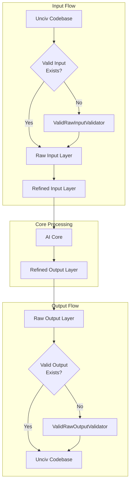

# AAutoExpert AI Development Project

> This document provides a high-level overview of the AAutoExpert project as outlined in `project_overview.md`. It provides a roadmap projecting each phase of development until completion. It serves as the primary guide for project scope and direction.

> **Road Map Documentation Requirements**
>
> This is a living document that must be modified and reorganized when project overview changes and must be updated to reflect current focus progress.
>
> 1. REQUIRED: Under "Planned Project Structure" section, update architecture when implementation plans change or current file structure in `architecture.md#current-file-structure` changes.
> 2. REQUIRED: Under "Current Development Focus" section, document all completed features, components, and tasks with file/function references and maintain links to corresponding `project_overview.md` sections
> 3. REQUIRED: Under "Current Development Focus" section goals, update goals to align with `project_overview.md`
> 4. REQUIRED: Under "Current Development Focus" section, keep features, components, and tasks synchronized with `project_overview.md#current-progress-status` and `current_focus.md#immediate-tasks`
> 5. REQUIRED: Task lists and Planned Project Structure folders/files have checkboxes, [ ] unstarted, [-] started, [✓] completed; unfinished tasks have % complete and required subtasks to complete.  
>
> All completed code, tasks and checkboxes, as well as any changed code, MUST include reference to related files and functions.

## 1. Project Structure

### 1.1 Overview
> The 5-layer pipeline architecture ensures clean separation between game state collection, processing, and action execution. This structure enables MVP development while maintaining extensibility for future enhancements.

### 1.2 Current File Structure
> Shows actual implementation in codebase. Requirements:
> 1. Must exactly match current files/folders in `/com/unciv/logic/aautoexpert/`
> 2. Use checkboxes: [ ] unstarted, [-] started, [✓] completed
> 3. Include completion percentages for unfinished components
> 4. Brief description comments after each entry
> 5. Indentation must show exact folder hierarchy
> 6. All changes must be reflected in architecture.md

---
autoexpert/
├── [✓] AAutoExpert.kt                     # Main entry point and coordinator
├── [-] expertmodules/                     # Basic module structure (30%)
│   ├── [-] expertmilitary/               # Military operations
│   │   ├── [-] ExpertMilitaryModule.kt    # Unit coordination
│   │   └── [-] experthandlers/            # Unit type handlers
│   │       ├── [-] ExpertSettlerHandler.kt # Settler movement logic
│   │       └── [-] ExpertMilitaryHandler.kt# Military unit control
│   │       ├── [ ] ExpertRangedHandler.kt  # Ranged unit control
│   │       └── [ ] ExpertNavalHandler.kt   # Naval unit control
│   │   └── [✓] expertcore/                   # Core interfaces
│   │       ├── [✓] AIModule.kt               # Base module interface
│   │       └── [-] ExpertStateLogger.kt       # State tracking and logging
│   └── [✓] expertutils/                      # Basic utilities (20%)
│       └── [-] ExpertMovementHelper.kt       # Safe movement utilities
---

### 1.3 Current Phase Target Structure
> Shows minimum files needed for current phase MVP. Requirements:
> 1. Only include files needed for current phase completion
> 2. Use checkboxes to track implementation status
> 3. Must align with goals in project_overview.md
> 4. Include brief descriptions of each component's purpose
> 5. Group related functionality in logical folders
> 6. Remove any files/features not needed for MVP

---
autoexpert/
├── [✓] AAutoExpert.kt                     # Main coordinator
├── [-] expertmodules/                     # Phase 1 modules
│   ├── [-] expertmilitary/               # Military focus
│   │   ├── [-] ExpertMilitaryModule.kt    # Unit coordination
│   │   └── [-] experthandlers/            # Unit handlers
│   │       ├── [-] ExpertSettlerHandler.kt # Settler logic
│   │       └── [ ] ExpertWarriorHandler.kt # Warrior logic
│   │       ├── [ ] ExpertRangedHandler.kt  # Ranged unit control
│   │       └── [ ] ExpertNavalHandler.kt   # Naval unit control
│   │   └── [✓] expertcore/                   # Core interfaces
│   │       ├── [✓] AIModule.kt               # Base module interface
│   │       └── [-] ExpertStateLogger.kt       # State tracking
├── [-] rulevalidator_patch/              # Validation layer
│   ├── [-] ValidRawInputValidator.kt      # Input validation
│   │   ├── [-] UnitValidation            # Unit validation
│   │   └── [ ] CityValidation            # City validation
│   └── [-] ValidRawOutputValidator.kt     # Output validation
│       ├── [-] UnitCommands              # Unit commands
│       └── [ ] CityCommands              # City commands
└── [-] expertutils/                      # Phase 1 utilities
    ├── [-] ExpertMovementHelper.kt       # Movement utilities
    └── [ ] ExpertMetrics.kt              # Basic metrics
---

### 1.4 Final Target Structure
> Shows complete system vision. Requirements:
> 1. Include all planned files/folders through project completion
> 2. Maintain consistent naming with current structure
> 3. Group components by domain and responsibility
> 4. Include detailed descriptions of each component
> 5. Show validation layer breakdown by domain
> 6. Indicate current progress with checkboxes and percentages
> 7. Structure must support all features in project_overview.md

The AAutoExpert structure is designed around two key components: a 5-layer pipeline for AI processing and domain-specific expert modules. The pipeline (expertrawinput → expertrefinedinput → expertcore → expertrefinedoutput → expertrawoutput) ensures clean separation between game state access and AI decisions, with validation at each layer. The expertcore is split into strategic analysis and decision synthesis to support both Monte Carlo Tree Search and Q-Learning techniques, while allowing different AI approaches as the system evolves. Domain modules (military, economy, etc.) are kept separate from the pipeline, allowing them to evolve independently through the AI levels (MVP to Superhuman) while maintaining consistent interfaces with the core through the ExpertModuleAPI. This structure supports immediate needs (like settler placement) while enabling gradual expansion through the game's eras, with each module capable of implementing increasingly sophisticated AI techniques without disrupting the overall architecture. The consistent expert/Expert prefix naming and clear separation of concerns makes the system maintainable and testable, while the validation layers ensure all AI actions comply with game rules.

---
autoexpert/
├── [✓] AAutoExpert.kt                           # Main coordinator
├── [-] expertpipeline/                          # 5-layer AI processing pipeline (15%)
│   ├── [-] expertrawinput/                      # Layer 1: Raw game state input
│   │   ├── expertvalidators/                    # Input validation
│   │   │   ├── ExpertUnitInputValidator.kt           # Unit state validation
│   │   │   ├── ExpertCityInputValidator.kt           # City state validation
│   │   │   └── ExpertTerrainInputValidator.kt        # Terrain state validation
│   │   ├── expertcollectors/                    # Raw data collection
│   │   │   ├── ExpertUnitStateCollector.kt           # Unit state collection
│   │   │   ├── ExpertCityStateCollector.kt           # City state collection
│   │   │   └── ExpertTerrainStateCollector.kt        # Terrain state collection
│   │   └── expertinterfaces/                    # Raw input interfaces
│   │       └── ExpertRawInputProvider.kt             # Base interface for raw inputs
│   │
│   ├── [-] expertrefinedinput/                  # Layer 2: Strategic assessment
│   │   ├── expertrefiners/                      # Input refinement
│   │   │   ├── ExpertTileRefiner.kt                  # Tile evaluation
│   │   │   ├── ExpertUnitRefiner.kt                  # Unit state refinement
│   │   │   └── ExpertCityRefiner.kt                  # City state refinement
│   │   ├── expertevaluators/                    # Strategic evaluation
│   │   │   ├── ExpertTileEvaluator.kt                # Tile scoring
│   │   │   ├── ExpertResourceEvaluator.kt            # Resource value calculation
│   │   │   └── ExpertPositionEvaluator.kt            # Position strategic value
│   │   └── expertinterfaces/                    # Refined input interfaces
│   │       └── ExpertRefinedInputProvider.kt          # Base interface for refined inputs
│   │
│   ├── expertcore/                              # Layer 3: AI Core
│   │   ├── expertstrategic/                     # First part of core
│   │   │   ├── expertanalysis/
│   │   │   │   ├── ExpertStrategyGenerator.kt
│   │   │   │   ├── ExpertPatternRecognizer.kt
│   │   │   │   └── ExpertVictoryPlanner.kt
│   │   │   └── expertcontext/
│   │   │       └── ExpertStrategicContext.kt
│   │   │
│   │   └── expertsynthesis/                     # Second part of core
│   │       ├── expertcollector/
│   │       │   └── ExpertDecisionCollector.kt
│   │       └── expertresolver/
│   │           └── ExpertDecisionSynthesizer.kt
│   │
│   ├── [-] expertrefinedoutput/                 # Layer 4: Action Planning
│   │   ├── expertplanners/                      # Strategic planning
│   │   │   ├── ExpertUnitActionPlanner.kt            # Unit action planning
│   │   │   ├── ExpertCityActionPlanner.kt            # City action planning
│   │   │   └── ExpertDiplomacyPlanner.kt             # Diplomatic action planning
│   │   ├── expertvalidators/                    # Plan validation
│   │   │   ├── ExpertUnitPlanValidator.kt            # Unit plan validation
│   │   │   └── ExpertCityPlanValidator.kt            # City plan validation
│   │   └── expertinterfaces/                    # Plan interfaces
│   │       └── ExpertActionPlan.kt                    # Action plan interface
│   │
│   └── [-] expertrawoutput/                     # Layer 5: Action Execution
│       ├── expertexecutors/                     # Command execution
│       │   ├── ExpertUnitCommandExecutor.kt           # Unit command execution
│       │   ├── ExpertCityCommandExecutor.kt           # City command execution
│       │   └── ExpertDiplomacyExecutor.kt             # Diplomacy execution
│       ├── expertvalidators/                    # Output validation
│       │   ├── ExpertUnitOutputValidator.kt           # Unit action validation
│       │   ├── ExpertCityOutputValidator.kt           # City action validation
│       │   └── ExpertDiplomacyValidator.kt            # Diplomacy validation
│       └── expertinterfaces/                    # Execution interfaces
│           └── ExpertCommandExecutor.kt                # Base executor interface
│
├── expertmodules/             # Domain modules
│   ├── expertcommon/
│   │   ├── ExpertModuleAPI.kt
│   │   └── ExpertDecisionTypes.kt
│   │
│   ├── expertmilitary/
│   │   ├── ExpertMilitaryModule.kt
│   │   ├── experthandlers/
│   │   │   ├── ExpertSettlerHandler.kt
│   │   │   ├── ExpertMilitaryHandler.kt
│   │   │   ├── ExpertSiegeHandler.kt
│   │   │   ├── ExpertNavalHandler.kt
│   │   │   ├── ExpertAirHandler.kt
│   │   │   └── ExpertNuclearHandler.kt
│   │   └── expertutils/
│   │       ├── ExpertBattleCalc.kt
│   │       └── ExpertFormation.kt
│   │
│   ├── [ ] expertcity/                          # City operations
│   │   ├── [ ] ExpertCityModule.kt                   # City coordination
│   │   ├── [ ] experthandlers/                  # City handlers
│   │   │   ├── [ ] ExpertGrowthHandler.kt            # Population management
│   │   │   ├── [ ] ExpertProductionHandler.kt        # Build management
│   │   │   └── [ ] ExpertSpecialistHandler.kt        # Specialist control
│   │   └── [ ] expertutils/                     # City utilities
│   │       └── [ ] ExpertCityCalc.kt                 # City calculations
│   │
│   ├── [ ] experteconomy/                       # Economic operations
│   │   ├── [ ] ExpertEconomyModule.kt                # Economy coordination
│   │   ├── [ ] experthandlers/                  # Economy handlers
│   │   │   ├── [ ] ExpertTradeHandler.kt             # Trade routes
│   │   │   ├── [ ] ExpertMarketHandler.kt            # Market/Bank timing
│   │   │   └── [ ] ExpertCorporateHandler.kt         # Corporate management
│   │   └── [ ] expertutils/                     # Economy utilities
│   │       └── [ ] ExpertResourceCalc.kt             # Resource calculations
│   │
│   ├── [ ] expertculture/                       # Cultural operations
│   │   ├── [ ] ExpertCultureModule.kt                # Culture coordination
│   │   ├── [ ] experthandlers/                  # Culture handlers
│   │   │   ├── [ ] ExpertPolicyHandler.kt            # Policy selection
│   │   │   ├── [ ] ExpertTourismHandler.kt           # Tourism management
│   │   │   └── [ ] ExpertArchaeologyHandler.kt       # Archaeological digs
│   │   └── [ ] expertutils/                     # Culture utilities
│   │       └── [ ] ExpertInfluenceCalc.kt            # Cultural influence calc
│   │
│   ├── [ ] expertscience/                       # Research operations
│   │   ├── [ ] ExpertScienceModule.kt                # Science coordination
│   │   ├── [ ] experthandlers/                  # Science handlers
│   │   │   ├── [ ] ExpertTechHandler.kt              # Tech tree navigation
│   │   │   ├── [ ] ExpertSpaceHandler.kt             # Space race projects
│   │   │   └── [ ] ExpertResearchHandler.kt          # Research agreements
│   │   └── [ ] expertutils/                     # Science utilities
│   │       └── [ ] ExpertTechCalc.kt                 # Tech value calculations
│   │
│   ├── [ ] expertreligion/                      # Religious operations
│   │   ├── [ ] ExpertReligionModule.kt               # Religion coordination
│   │   ├── [ ] experthandlers/                  # Religion handlers
│   │   │   ├── [ ] ExpertBeliefHandler.kt            # Belief selection
│   │   │   ├── [ ] ExpertSpreadHandler.kt            # Religious unit control
│   │   │   └── [ ] ExpertPressureHandler.kt          # Religious pressure
│   │   └── [ ] expertutils/                     # Religion utilities
│   │       └── [ ] ExpertFaithCalc.kt                # Faith calculations
│   │
│   └── [ ] expertdiplomacy/                     # Diplomatic operations
│       ├── [ ] ExpertDiplomacyModule.kt              # Diplomacy coordination
│       ├── [ ] experthandlers/                  # Diplomacy handlers
│       │   ├── [ ] ExpertDealHandler.kt              # Trade deals
│       │   ├── [ ] ExpertWarHandler.kt               # War declarations
│       │   ├── [ ] ExpertCityStateHandler.kt         # City-state relations
│       │   └── [ ] ExpertVictoryHandler.kt           # Diplomatic victory
│       └── [ ] expertutils/                     # Diplomacy utilities
│           └── [ ] ExpertThreatCalc.kt               # Threat calculations
├── [ ] experttesting/                           # Test implementations
│   ├── [ ] ExpertTestGame.kt                    # Test game setup
│   ├── [ ] ExpertUnitTests.kt                   # Unit testing
│   └── [ ] expertintegration/                   # Integration tests
└── [-] expertutils/                             # Global utilities (20%)
    ├── [-] ExpertMovementHelper.kt              # Safe movement utilities
    ├── [ ] ExpertLogger.kt                      # Enhanced logging
    ├── [ ] ExpertMetrics.kt                     # Performance monitoring
    └── [ ] ExpertDebugger.kt                    # Debug utilities
---

### 1.5 Pipeline Architecture
> Visualizes data flow and module interactions. Critical for understanding how components communicate and maintaining clean separation between layers.



## 2. Current Development Focus: Milestone 1.2 - Early Game Basics
> This section outlines the Features needed to complete the current Milestone, breaking each into key Components. Components track overall progress but defer implementation details to `current_focus.md`.

## 2. Current Development Focus: Milestone 1.2 - Early Game Basics
> This section outlines the Features needed to complete the current Milestone, breaking each into key Components. Components track overall progress but defer implementation details to `current_focus.md`.

### 2.1 Feature 1: First Turn Decision Making (35%)
*(Ref: `project_overview.md#milestone-1.2`)*

#### 2.1.1 Component 1: Settler Movement Logic (40%)
- [✓] Initial position evaluation
- [-] Resource proximity scoring (50%)
  - [✓] Basic luxury resource scoring
  - [-] Strategic resource evaluation (30%)
  - [ ] Resource accessibility validation
- [-] Strategic location assessment (20%)
  - [-] Basic terrain evaluation
  - [ ] Growth potential analysis
  - [ ] Defensive position scoring
- [-] Movement path optimization (10%)
  - [-] Basic pathfinding
  - [ ] Threat avoidance
  - [ ] Military escort coordination

#### 2.1.2 Component 2: City Placement System (30%)
- [✓] Basic resource evaluation
- [-] Growth potential analysis (60%)
  - [✓] Food source evaluation
  - [-] Production tile analysis
  - [ ] Population growth projection
- [-] Strategic value calculation (20%)
  - [-] Defensive terrain assessment
  - [ ] Trade route potential
  - [ ] Resource monopoly potential
- [ ] Defensive position assessment

#### 2.1.3 Component 3: Starting Unit Control (20%)
- [✓] Warrior positioning
- [-] Military escort logic (40%)
  - [✓] Basic settler protection
  - [-] Threat response
  - [ ] Formation movement
- [ ] Scout movement patterns
- [ ] Barbarian camp handling

### 2.2 Feature 2: Early Production Queue (15%)
*(Ref: `project_overview.md#milestone-1.2`)*

#### 2.2.1 Component 1: Build Order Priority (15%)
- [-] Scout vs Warrior evaluation (40%)
  - [✓] Basic unit comparison
  - [-] Terrain-based decision making (30%)
  - [ ] Threat level assessment
- [ ] Worker timing optimization
  - [ ] Resource improvement priority
  - [ ] Growth vs Production balance
- [ ] Monument consideration
  - [ ] Culture value assessment
  - [ ] Border expansion needs
- [ ] Resource improvement sequencing
  - [ ] Luxury vs Strategic priority
  - [ ] Growth resource timing

#### 2.2.2 Component 2: Resource Management (10%)
- [-] Initial tile working strategy (30%)
  - [✓] Basic food priority
  - [-] Production balance (20%)
  - [ ] Growth timing
- [ ] Growth vs Production balance
  - [ ] Population target calculation
  - [ ] Production needs assessment
- [ ] Luxury resource prioritization
  - [ ] Happiness impact evaluation
  - [ ] Trade potential analysis
- [ ] Strategic resource planning
  - [ ] Military needs projection
  - [ ] Resource monopoly potential

### 2.3 Feature 3: Initial Expansion Planning (8%)
*(Ref: `project_overview.md#milestone-1.2`)*

#### 2.3.1 Component 1: Territory Assessment (5%)
- [-] Second city location scoring (20%)
  - [✓] Basic resource evaluation
  - [-] Strategic position analysis (10%)
  - [ ] Growth potential calculation
- [ ] Border expansion prediction
  - [ ] Culture growth modeling
  - [ ] Tile acquisition priority
- [ ] Resource securing strategy
  - [ ] Luxury resource control
  - [ ] Strategic resource access
- [ ] Chokepoint identification
  - [ ] Terrain analysis
  - [ ] Strategic value calculation

#### 2.3.2 Component 2: Early Military Security (10%)
- [-] Threat assessment system (25%)
  - [✓] Basic unit strength comparison
  - [-] Terrain advantage calculation (15%)
  - [ ] Multi-unit threat analysis
- [ ] Defensive unit positioning
  - [ ] Terrain utilization
  - [ ] City protection coverage
- [ ] Barbarian camp clearing priority
  - [ ] Risk vs Reward evaluation
  - [ ] Resource path security
- [ ] Scout safety protocols
  - [ ] Retreat path planning
  - [ ] Risk level assessment

### 2.4 Feature 4: Early Diplomacy (9%)
*(Ref: `project_overview.md#milestone-1.2`)*

#### 2.4.1 Component 1: Initial Diplomatic Relations (10%)
- [ ] Alliance initiation protocols
  - [ ] Neighbor strength assessment
  - [ ] Mutual benefit analysis
- [-] Threat assessment (30%)
  - [✓] Military strength comparison
  - [-] Border tension evaluation (20%)
  - [ ] Expansion path conflicts
- [ ] Diplomatic messaging system
  - [ ] Message priority calculation
  - [ ] Response pattern analysis
- [ ] Trade negotiation strategies
  - [ ] Resource value calculation
  - [ ] Deal fairness assessment

#### 2.4.2 Component 2: Diplomatic Strategy Development (8%)
- [ ] Early game treaties
  - [ ] Open borders timing
  - [ ] Research agreement value
- [ ] Strategic alliance formation
  - [ ] Partner selection criteria
  - [ ] Alliance timing optimization
- [-] Diplomacy logging (25%)
  - [✓] Basic interaction tracking
  - [-] Pattern recognition (15%)
  - [ ] Response effectiveness analysis
- [ ] Reactive adjustments
  - [ ] Threat response protocols
  - [ ] Opportunity recognition

### 2.5 Feature 5: Economic Foundations (10%)
*(Ref: `project_overview.md#milestone-1.2`)*

#### 2.5.1 Component 1: Early Gold Management (8%)
- [-] Gold income optimization (20%)
  - [✓] Basic tile working
  - [-] Trade route evaluation (10%)
  - [ ] Building priority
- [ ] Early investment strategies
  - [ ] Tile purchase evaluation
  - [ ] Building purchase timing
- [ ] Economic event responses
  - [ ] Resource loss mitigation
  - [ ] Opportunity cost analysis
- [ ] Budget allocation
  - [ ] Military maintenance
  - [ ] Development investment

#### 2.5.2 Component 2: Resource Allocation Strategies (12%)
- [-] Resource type balancing (30%)
  - [✓] Basic resource categorization
  - [-] Priority assignment (20%)
  - [ ] Distribution optimization
- [ ] Luxury vs strategic prioritization
  - [ ] Happiness needs assessment
  - [ ] Military requirements analysis
- [ ] Dynamic prioritization
  - [ ] Situation response system
  - [ ] Need vs Want evaluation
- [ ] City resource distribution
  - [ ] Growth support allocation
  - [ ] Production enhancement


## 3. Current Feature Implementation: Feature 1 - Settler Movement Logic
> This section details the specific code changes needed to evolve the current Feature toward our current Phase Target Structure. It shows both current implementation and planned changes to help developers understand the transformation path.

### 3.1 Current Implementation Analysis
> Analysis of MilitaryModule.kt showing current functionality organization. The file tree must show:
> 1. All functions grouped by their role (Properties, Core Functions, etc.)
> 2. Complete function signatures including parameters and return types
> 3. Key properties and their types
> 4. Important dependencies and imports
> 5. Any extension functions or special modifiers
> This detailed breakdown helps identify code that needs to be extracted or refactored in the transformation process.

```kotlin
MilitaryModule.kt
├── Properties
│   ├── private fun MapUnit.isRanged(): Boolean
│   ├── private fun MapUnit.isMelee(): Boolean
│   └── private fun MapUnit.canMove(): Boolean
├── Core Functions
│   ├── override fun processDecisions(civInfo: Civilization)
│   ├── private fun getUnitPriority(unit: MapUnit): Int
│   └── private fun processUnitDecision(unit: MapUnit)
├── Unit Handlers
│   ├── private fun handleRangedUnit(unit: MapUnit)
│   ├── private fun handleMeleeUnit(unit: MapUnit)
│   └── private fun handleOtherMilitaryUnit(unit: MapUnit)
├── Combat Logic
│   ├── private fun evaluateRangedTargets(unit: MapUnit, targets: List<MapUnit>): MapUnit?
│   └── private fun findOptimalRangedPosition(unit: MapUnit): Tile?
└── Utility Functions
    ├── private fun evaluateDefensivePosition(tile: Tile): Float
    ├── private fun evaluateThreatLevel(tile: Tile, unit: MapUnit): Float
    ├── private fun tryHealUnit(unit: MapUnit): Boolean
    ├── private fun shouldGarrison(unit: MapUnit): Boolean
    └── private fun findGarrisonCity(unit: MapUnit): City?
```

### 3.2 Target Implementation
> Final structure after implementing all changes. The file tree must show:
> 1. Complete class and function signatures including parameters, return types, and visibility modifiers
> 2. Properties with their types and visibility
> 3. Key dependencies and imports
> 4. Interface implementations and inheritance
> 5. Package organization and file grouping
> This detailed structure serves as the blueprint for the transformation process.

```kotlin
expertmilitary/
├── ExpertMilitaryModule.kt                 # Main military coordination
│   ├── Dependencies
│   │   ├── import com.unciv.logic.aautoexpert.modules.core.AIModule
│   │   ├── import com.unciv.logic.aautoexpert.expertutils.ExpertStateManager
│   │   └── import com.unciv.logic.civilization.Civilization
│   ├── Properties
│   │   ├── private val stateManager: ExpertStateManager
│   │   ├── private val unitHandlers: Map<UnitType, UnitHandler>
│   │   └── private val battleCalculator: ExpertBattleCalc
│   ├── Core Functions
│   │   ├── override fun processDecisions(civInfo: Civilization)
│   │   ├── private fun delegateUnitControl(unit: MapUnit): Boolean
│   │   └── private fun updateMilitaryState(civInfo: Civilization)
│   └── Event Handlers
│       ├── private fun onUnitCreated(unit: MapUnit)
│       └── private fun onUnitDestroyed(unit: MapUnit)
├── experthandlers/                         # Specialized unit handlers
│   ├── UnitHandler.kt                     # Base handler interface
│   │   └── interface UnitHandler
│   │       ├── fun canHandle(unit: MapUnit): Boolean
│   │       ├── fun handleUnit(unit: MapUnit)
│   │       └── fun getPriority(): Int
│   ├── ExpertSettlerHandler.kt            # Settler unit control
│   │   └── class ExpertSettlerHandler : UnitHandler
│   │       ├── override fun canHandle(unit: MapUnit): Boolean
│   │       ├── override fun handleUnit(unit: MapUnit)
│   │       ├── override fun getPriority(): Int
│   │       ├── fun evaluatePosition(tile: Tile): Float
│   │       ├── fun calculateResourceScore(tile: Tile): Float
│   │       └── fun determineOptimalPath(start: Tile, target: Tile): List<Tile>
│   ├── ExpertRangedHandler.kt             # Ranged unit control
│   │   └── class ExpertRangedHandler : UnitHandler
│   │       ├── override fun canHandle(unit: MapUnit): Boolean
│   │       ├── override fun handleUnit(unit: MapUnit)
│   │       ├── override fun getPriority(): Int
│   │       ├── fun evaluateTargets(unit: MapUnit): List<MapUnit>
│   │       └── fun findOptimalPosition(unit: MapUnit): Tile
│   └── ExpertWarriorHandler.kt            # Melee unit control
│       └── class ExpertWarriorHandler : UnitHandler
│           ├── override fun canHandle(unit: MapUnit): Boolean
│           ├── override fun handleUnit(unit: MapUnit)
│           ├── override fun getPriority(): Int
│           ├── fun evaluateCombatPosition(tile: Tile): Float
│           └── fun calculateThreatResponse(threats: List<MapUnit>): Action
└── expertutils/                           # Utility modules
    ├── ExpertBattleCalc.kt               # Combat calculations
    │   └── object ExpertBattleCalc
    │       ├── fun calculateEngagementOutcome(attacker: MapUnit, defender: MapUnit): CombatPrediction
    │       ├── fun evaluatePositionalAdvantage(unit: MapUnit, tile: Tile): Float
    │       └── fun predictBattleDamage(attacker: MapUnit, defender: MapUnit): Float
    └── ExpertTactics.kt                  # Strategic utilities
        └── object ExpertTactics
            ├── fun evaluateDefensivePosition(tile: Tile): Float
            ├── fun calculateThreatLevel(tile: Tile, unit: MapUnit): Float
            └── fun findOptimalRetreatPath(unit: MapUnit, threats: List<MapUnit>): List<Tile>
```
